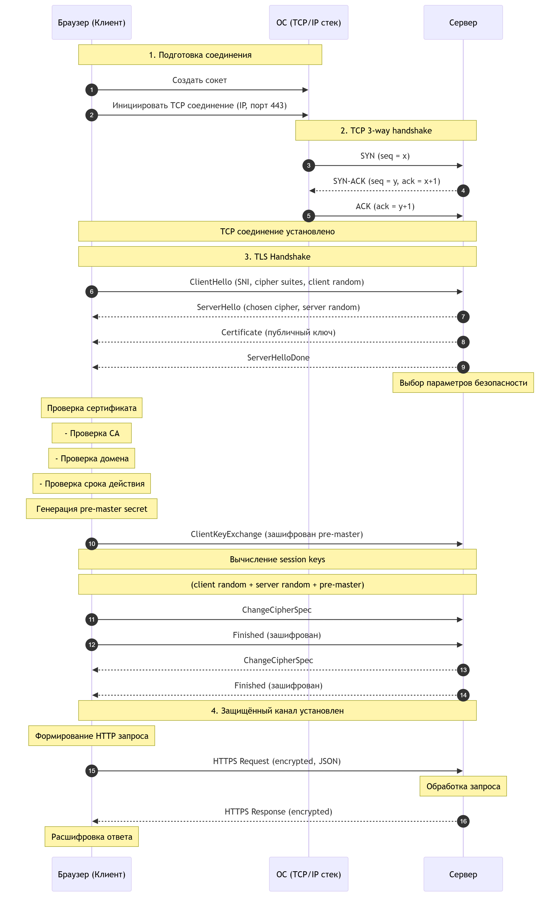
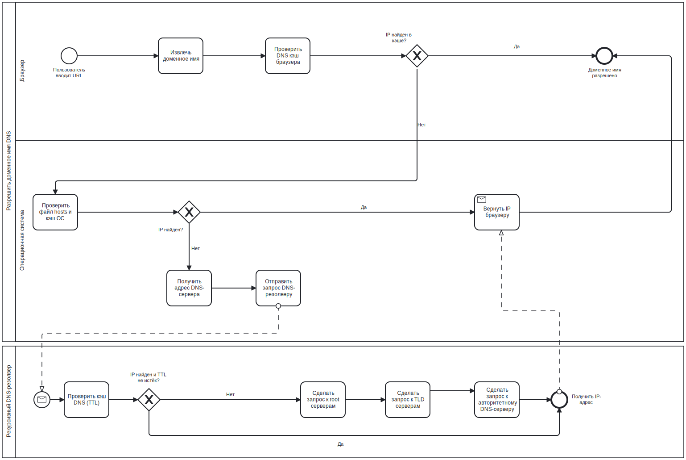

## Контекстная диаграмма, смоделированная в нотации IDEF0
Здесь показано высокоуровневое взаимодействие системы с внешними сущностями.

---

## Декомпозиция процесса (Уровень А0), смоделированная в нотации IDEF0

IDEF0 помогает рассмотреть иерархические связи в системе, просмотреть, что от чего зависит, чем система контролируется и какие в ней задействованы общие механизмы. Также плюс этой нотации в том, что она помогает глубже изучить рассматриваемую систему, разобрать её подсистемы и увидеть зависимости.

## Процесс обмена сетевыми пакетами, смоделированная в нотации UML Sequence Diagram.

    

Нотация UML в Sequence-диаграмме помогает просмотреть ответственность акторов во времени.
## Процесс получения IP-адреса через систему доменных имен, смоделированный в нотации BPMN.

Нотация BPMN отлично помогает просмотреть риски, связанные с разветвлением в альтернативных потоках; позволяет учитывать не только позитивный сценарий развития событий, но также помогает лучше продумать поведение системы во времени. Учитывая наличие пулов, она позволяет рассмотреть разные точки зрения (point of view).

 Все эти нотации показывают разные уровни абстракции, и их преимущество в том, что в дальнейшем их можно декомпозировать до нужного уровня.
